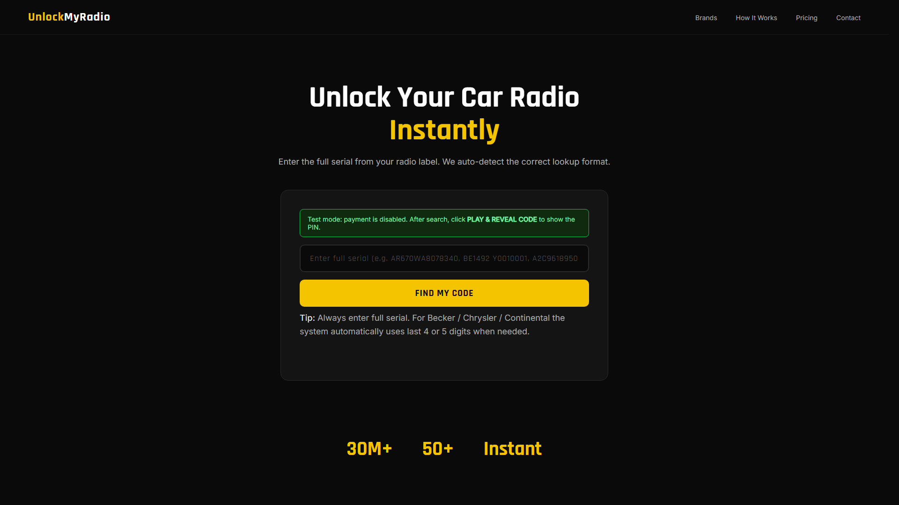

# UNDER DEVELOPMENT

<p align="center">
  <a href="docs/images/unlockmyradio-hero-v2.png">
    
  </a>
</p>

# UnlockMyRadio

UnlockMyRadio is a car radio unlock code platform built with Laravel + MySQL.

Users enter a radio serial, the system resolves the correct lookup strategy, and then either:
- reveals the code directly in test mode, or
- completes Stripe checkout and reveals the code after successful payment.

## Stack

- PHP 8.3+
- Laravel 13
- MySQL (production)
- Stripe Checkout (`stripe/stripe-php`)
- Vite frontend assets

## Core Features

- Serial search with normalization and family-specific fallback logic
- Multi-result model selection flow (Becker, Chrysler, Continental overlaps)
- Web checkout + payment success reveal
- Public API v1 (`/api/v1/*`) for search and checkout
- Reseller API with credit-based decode flow and API key auth
- Bulk importer command for TXT code tables

## Serial Lookup Logic

Implemented in `app/Support/RadioCodeResolver.php`.

Flow:
1. Exact match on normalized serial and compact serial
2. Fallback by family when exact match fails
3. If multiple records match, return selection options

Fallback rules:
- Becker: detect `BE...` or 8-digit patterns, lookup by last 4 digits
- Continental: detect `A2C...`, `A3C...`, `TVPQN...`, lookup by last 4 digits
- Chrysler: detect `T...`, try last 5 first, then last 4

Important DB rule:
- `radio_codes` is unique by `(serial, brand, car_make)` - not by `serial` alone.

Detailed rule reference:
- `docs/SERIAL_LOOKUP_RULES.md`

## Web Routes

Defined in `routes/web.php`.

- `GET /` - home search page
- `POST /search` - resolve serial
- `POST /search/select` - confirm model selection when multiple matches
- `POST /checkout` - start checkout (or direct reveal in test mode)
- `GET /payment/success` - reveal code after paid Stripe session

Hardening behavior:
- `GET /search`, `GET /search/select`, `GET /checkout` route back to home instead of returning 405.

## API v1 Routes

Defined in `routes/api.php`, all under `/api/v1`.

- `POST /search`
- `POST /checkout`
- `GET /payment/success`
- `GET /reseller/balance`
- `POST /reseller/decode`

API docs:
- `docs/API_V1.md`
- `docs/RESELLER_API.md`

## Reseller Credit System

Tables:
- `resellers`
- `reseller_api_keys`
- `reseller_credit_logs`

Auth:
- `Authorization: Bearer <API_KEY>` or
- `X-Api-Key: <API_KEY>`

Behavior:
- each successful `/api/v1/reseller/decode` consumes 1 credit in a DB transaction
- API keys are stored as SHA-256 hashes
- create command prints plaintext key once

Useful commands:

```bash
php artisan reseller:create "Partner Name" --email=partner@example.com
php artisan reseller:credit 1 100
php artisan reseller:credit 1 -10 --reason=manual_fix
```

## Test Mode vs Live Mode

Config key:
- `UNLOCK_DIRECT_REVEAL`

When `true`:
- payment is bypassed in web flow
- result page shows `PLAY & REVEAL CODE`

When `false`:
- Stripe checkout is required to reveal code

After changing env in production:

```bash
php artisan optimize:clear
php artisan config:cache
php artisan route:cache
```

## Local Development

1. Install dependencies
```bash
composer install
npm install
```

2. Configure environment
```bash
cp .env.example .env
php artisan key:generate
```

3. Set DB and run migrations
```bash
php artisan migrate
```

4. Run app
```bash
composer run dev
```

## Required Environment Variables

Minimum for full functionality:

```dotenv
APP_URL=https://your-domain.com
DB_CONNECTION=mysql
DB_HOST=127.0.0.1
DB_PORT=3306
DB_DATABASE=unlockmyradio
DB_USERNAME=...
DB_PASSWORD=...

STRIPE_KEY=pk_...
STRIPE_SECRET=sk_...

UNLOCK_DIRECT_REVEAL=true
RESELLER_TEST_DEFAULT_CREDITS=50
```

## Importing Radio Code Tables

Bulk import command:

```bash
php artisan import:radiocodes /absolute/path/to/txt/folder
```

Importer behavior:
- scans `*.txt`
- maps filename/prefix to `brand` and `car_make`
- tags overlap-sensitive families with `prefix` values (for example `CHR55`, `CHR56`, `CHR4`, `CONT4`, `B4BTN`, `B6BTN`, `B8BTN`)
- inserts in batches via `insertOrIgnore`

## Deployment (Current VPS Flow)

```bash
git pull origin main
php artisan optimize:clear
php artisan config:cache
php artisan route:cache
```

## Project Structure (Key Files)

- `app/Support/RadioCodeResolver.php` - serial normalization and fallback lookup
- `app/Http/Controllers/RadioCodeController.php` - web flow
- `app/Http/Controllers/Api/RadioCodeApiController.php` - public API flow
- `app/Http/Controllers/Api/ResellerApiController.php` - credit API
- `app/Console/Commands/ImportRadioCodes.php` - TXT import
- `config/unlock.php` - direct reveal mode switch
- `resources/views/result.blade.php` - reveal/payment UI
- `resources/views/select-model.blade.php` - variant chooser

## Security Notes

- Never commit real API keys, Stripe keys, or server credentials.
- If any token is exposed in chat/logs, rotate it immediately.
